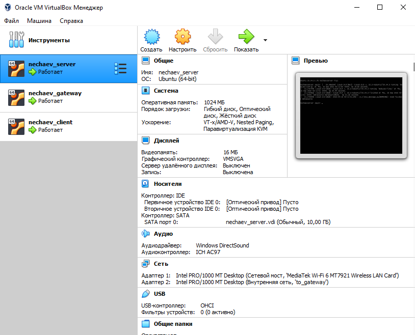

##Создание и настройка виртуальных машин
-----
1. Создадим виртуальные машины в VirtualBox

2. Настроим сеть сервера

3. Настроим сеть шлюза

4. Настроим сеть клиента

## Настройка профилей виртуальных машин
------
1. Настройка профиля сервера

2. Настройка профиля шлюза

3. Настройка профиля клиента

## Подключение по ssh
----
1. Установка на всех машинах OpenSSH

2. Подключение к серверу по ssh

## Конфигурация сети сервера
----
1. Редактирование конфига с настройками сети сервера

2. Настройка конфига в текстовом редакторе

3. Проверка конфига на ошибки и его применение

4. Вывод на экран настроенных сетевых интерфейсов сервера

## Конфигурация сети шлюза
-----
1. Редактирование конфига с настройками сети шлюза

2. Настройка конфига в текстовом редакторе

3. Проверка конфига на ошибки и его применение

4. Вывод на экран настроенных сетевых интерфейсов шлюза

## Конфигурация сети клиента
-----
1. Редактирование конфига с настройками сети клиента

2. Настройка конфига в текстовом редакторе

3. Проверка конфига на ошибки и его применение

4. Вывод на экран настроенных сетевых интерфейсов клиента

## Создание http-сервера
-------
1. Установим на виртуальную машину (сервер) дистрибутив Python

2. Создадим виртуальное окружение

3. Установим библиотеку FLask

4. Результаты установки

5. Установим Flask в созданное виртуальное окружение, так как при установке Flask в домашнюю директорию выдается предупреждение

6. Создадим текстовый файл,содержащий скрипт создания http-сервера на языке Python

7. Вручную запустим скрипт

## Создание службы автозапуска
------
1. В папке с сервисами создадим текстовый документ

2. Необходимый текст внутри текстового документа

3. Включим службу

4. Служба не включилась

## Настройка маршрута пакетов с помощью iptables
----
1. Настройка пропуска пакетов, имеющих протокол tcp через 5000 порт

2. Запрет на отправку всех пакетов по умолчанию

3. Список всех ограничений iptables

4. Сохранение настроек iptables

5. Сохранение настроек iptables в отдельный файл

## Настройка сквозного прохода пакетов через шлюз 
------
1. Включение форвардинга пакетов

2. Настройка автоматического включения путем редактирования файла sysctl.conf

## Проверка работоспосоности сервера
-----
1. С помощью команды curl отправим запрос GET на http-сервер

